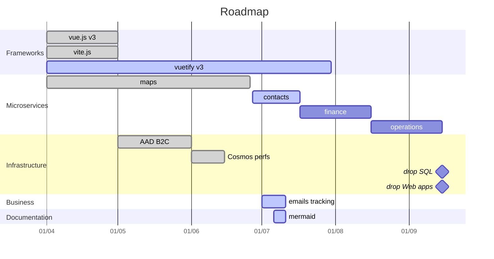

# Public roadmap

## Introduction

This page presents the public roadmap for the `amilochau` organization. The following items are grouped by quarter, and labeled with meta information.

---

## Current quarter

### 2022 Q3

| State | Title | Tags | Comment |
| ----- | ----- | ---- | ------- |
| 🔜 | Separate contacts from *milochau.com* | `infra`, `microservices`, `business` | Contacts are a specific business domain, today grouped in the *milochau.com* application. We should separate them, and deploy the new `contacts` application as an Azure Functions / Static Web Apps module. |
| | Separate operations from *milochau.com* | `infra`, `microservices`, `business` | Operations are a specific business domain, today grouped in the *milochau.com* application. We should separate them, and deploy the new `operations` application as an Azure Functions / Static Web Apps module. |
| | Separate finance from *milochau.com* | `infra`, `microservices`, `business` | Finance is a specific business domain, today grouped in the *milochau.com* application. We should separate them, and deploy the new `finance` application as an Azure Functions / Static Web Apps module. |

---

## Future quarters

These roadmap items are expected to be delivered soon. The dates indicated here are informative, and could change in the future.

### 2022 Q4+

| Title | Tags | Comment |
| ----- | ---- | ------- |
| Abandon SQL databases | `storage` | Azure SQL databases are expensive, and rarely match our needs - as we now use more hierarchical data. We should abandon SQL databases in our applications, and propose more custom alternatives. |
| Support Azure Policy | `infra`, `devops`, `security` | Azure Policy let us define security and compliance rules on our Azure resources. We should propose ARM Templates, and a set of default rules. |
| Extend with Log Analytics | `infra`, `monitoring` | Log Analytics workspaces could retrieve monitoring data from more than Application Insights. We should propose ARM Templates to let applications or storage resources send more data. |
| Propose vue.js template library | `web`, `core` | Our Front-End applications use a common set of features. We should create a dedicated Node.js (vue.js) library to expose these features. |
| Centralize health status | `infra`, `monitoring` | Each application exposes a health endpoint; we should now propose a consolidated API to present the health of our organization |

---

## Past quarters

These roadmap items have been delivered, as they are now implemented.

### 2022 Q2

| State | Title | Tags | Comment |
| ----- | ----- | ---- | ------- |
| ✔️ | Use vue.js v3 | `web`, `vue` | A new major version for vue.js has been released for a while. We should migrate at least one of our our applications. |
| ✔️ | Use vite.js | `devops`, `vue` | vue.js projects now commonly use vite.js to improve build. We should use this library as soon as our projects use vue.js v3. |
| ✔️ | Use vuetify v3 | `web`, `vue` | A new major version for vue.js has been released for a while. We should migrate at least one of our applications to use the next vuetify version. |
| ✔️ | Use AAD B2C for authentication | `infra`, `auth`, `security` | Azure AD B2C let applications centralize their user information and authentication pages, in a secured and compliant way. We should use this way in all our applications, coupled with API Management and Azure Functions. |
| ✔️ | Separate trips from *milochau.com* | `infra`, `microservices`, `business` | Trips are a specific business domain, today grouped in the *milochau.com* application. We should separate them, and deploy the new `maps` application as an Azure Functions / Static Web Apps module. |
| ✔️ | Optimize Cosmos DB performances | `infra`, `storage`, `performances` | Cosmos DB accounts are used with a consumption billing plan. We should now implement performance improvements (indexes, patch, model design). |

### 2022 Q1

| State | Title | Tags | Comment |
| ----- | ----- | ---- | ------- |
| ✔️ | Migrate to .NET 6, Functions v4 | `csharp`, `infra`, `core` | New versions for Microsoft-stack frameworks have been released. We should migrate our libraries and applications, and adapt our templates and workflows. |
| ✔️ | Support CosmosDB databases | `infra`, `storage`, `core` | CosmosDB is a common solution for NOSQL storage, with automatic scalability and redundancy. We should propose ARM Templates and Core helpers to help developers use this kind of resource, and implement it in at least one sample project. |

### 2021 Q4

| State | Title | Tags | Comment |
| ----- | ----- | ---- | ------- |
| ✔️ | Support Static Web Apps | `infra`, `web` | Static Web Apps are a good way to deploy static sites at low costs. We should propose ARM Templates, custom GitHub Actions, and at least one sample project. |
| ✔️ | Create and deploy a CV application | `business` | A *CV* (*Curriculum Vitae*) is an essential part to present organization members. We should propose this application as a part of our portfolio. |
| ✔️ | Automate Azure Portal Dashboards | `infra`, `monitoring` | Azure Portal Dashboards are the most simple way to group monitoring information, as from Application Insights or Web Apps metrics. We should propose ARM Templates to automate their creation and maintenance. |
| ✔️ | Automate GitHub management | `devops` | Multiple GitHub repositories are harder to maintain. We should create and manage these repositories in an automated way. | 

### 2021 Q3

| State | Title | Tags | Comment |
| ----- | ----- | ---- | ------- |
| ✔️ | Use GitHub for code | `devops` | Azure DevOps is now outdated. We need to migrate our code repositories to GitHub. |
| ✔️ | Propose GitHub Actions as workflows | `devops` | We've decided to migrate from Azure DevOps. We should then propose custom GitHub Actions, to replace old Azure Pipelines. |
| ✔️ | Automate infrastructure | `infra`, `devops` | Our infrastructure becomes larger, due to new applications and a microservices architecture. We need to define and deploy our infrastructure with ARM Templates, defined in Bicep. |
| ✔️ | Support API Management | `infra` | Many APIs are created with Azure Functions, and should be secured behind a gateway. API Management should be supported: we should propose ARM Templates, custom GitHub Actions, and at least one sample project. |
| ✔️ | Support OpenAPI in Azure Functions | `csharp`, `core`, `web` | OpenAPI (Swagger) is a common specification for APIs. We should support these definitions in our exposed endpoints. |
| ✔️ | Separate content from *milochau.com* | `business` | Content, such as image files, is an essential part to securely manage uploads from end users, and serve files in a performant way. We should propose this application as part of our portfolio. |
| ✔️ | Support CDN on storage | `infra`, `storage` | Azure CDN improves the performances of Storage Account exposed resources. We should propose ARM Templates to manage this scenario. |
| ✔️ | Automate storage cleanup | `infra`, `devops` | Azure Storage content should be cleaned up regularly in some scenarios. We should propose ARM Templates to automate these tasks from Azure Storage Accounts. |
| ✔️ | Support Log Analytics | `infra`, `monitoring` | Azure Log Analytics let us group metrics from different resources. We should propose ARM Templates to create Log Analytics workspaces, and send metrics from Application Insights resources. |

---

## Prior roadmap

The roadmap items before 2021 Q3 are tracked on the Azure DevOps organization, and have not been migrated here yet. See [this issue](https://github.com/amilochau/.github/issues/8) to subscribe on the migration progression.
