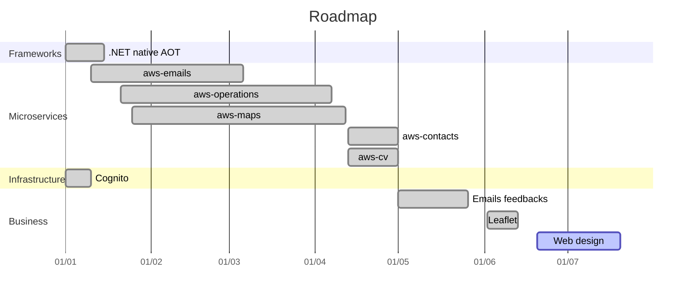
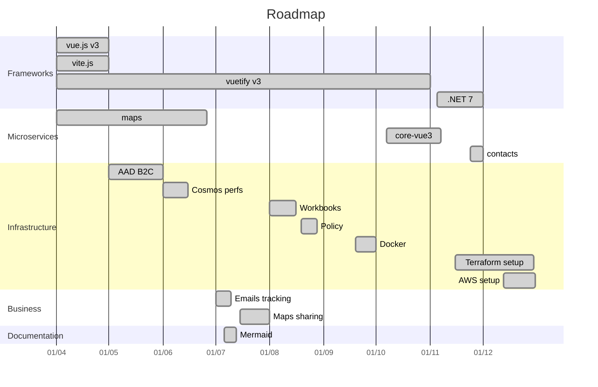

# Public roadmap

## Introduction

This page presents the public roadmap for the `amilochau` organization. The following items are grouped by quarter, and labeled with meta information.

---

## Current quarter

### 2023 Q3

| State | Title | Tags | Comment |
| ----- | ----- | ---- | ------- |
| ✔️ | Icons | `web` | Our websites lack a strong UI identity. Thanks to generative AI, we can now generate icons and images more easily. |
| 🔜 | Landing pages | `web` | External users coming to our websites can't easily understand what they can do with them. We should add landing pages to explain the main available features. |
| 🔜 | Use AWS X-Ray | `infra`, `monitoring` | Multiple services hosted in AWS are hard to monitor, with their many dependencies. We should use AWS X-Ray. |
| | Secure private data | `infra`, `network` | Data storages can contain sensitive data. We should add another security layer using network isolation. |
| | AWS budgets | `infra`, `monitoring` | With more services hosted in AWS, we should now manage budgets to avoid surprises with consumption-based resources. |

---

## Future quarters

These roadmap items are expected to be delivered soon. The dates indicated here are informative, and could change in the future.

### 2023 Q4+

| Title | Tags | Comment |
| ----- | ---- | ------- |
| Setup alerts on monitoring | `infra`, `monitoring` | Our resources are now monitored with different metrics and logs. We should configure alerts to be notified when thresholds on KPIs are met. |
| Use reusable GitHub workflows | `devops` | Instead of re-defining workflows in each repository, we should use reusable GitHub workflows, using our centralized GitHub Actions. |
| Migrate to .NET 8 | `csharp`, `core` | New versions for Microsoft-stack frameworks are regularly released. We should migrate our libraries and applications, and adapt our templates and workflows. |

---

## Past quarters

These roadmap items have been delivered, as they are now implemented.

---

### 2023

#### 2023 Q2

| State | Title | Tags | Comment |
| ----- | ----- | ---- | ------- |
| ✔️ | Abandon SQL databases | `storage` | Azure SQL databases are expensive, and rarely match our needs - as we now use more hierarchical data. We should abandon SQL databases in our applications, and propose more efficient alternatives based on AWS services. |
| ✔️ | Migrate contacts to AWS | `infra`, `microservices` | The contacts microservice is hosted on Azure. Now we want to use AWS, we should migrate to a new Lambda-based application. |
| ✔️ | Migrate CV to AWS | `infra`, `microservices` | The CV page is hosted on Azure. Now we want to use AWS, we should migrate to a new S3-based application, using vue.js v3. |
| ✔️ | Abandon Azure | `infra`, `devops` | AWS is a proven way to make serverless applications better than Azure. We should migrate all our workloads. |
| ✔️ | Use Leaflet for maps | `web`, `maps` | Google Maps have poor performances and lacks important data. We should use leaflet, with OpenStreetMaps data. |

#### 2023 Q1

| State | Title | Tags | Comment |
| ----- | ----- | ---- | ------- |
| ✔️ | Setup AWS Cognito | `infra`, `auth` | AWS Cognito can be used to authenticate our future Lambda-based services. We should setup it, and integrate it with our Front-End libraries. |
| ✔️ | Use native AOT for .NET | `infra`, `csharp` | New deployment models help to reduce cold start duration. We should build our Lambda-based applications as native AOT code, so we improve performances and decrease cost. |
| ✔️ | Use AWS for emails | `infra`, `microservices` | AWS proposes integrated workflows to send emails, with SES v2. We should define a Lambda-based process and migrate from Azure. |
| ✔️ | Use AWS for maps | `infra`, `microservices` | AWS proposes efficient serverless resources, with Lambda functions, API Gateway and CloudFront. We should rework the maps microservice as a Lambda-based application, and migrate from Azure. |
| ✔️ | Separate operations from *milochau.com* | `infra`, `microservices`, `business` | Operations are a specific business domain, today grouped in the *milochau.com* application. We should separate them, and deploy the new `operations` application as a serverless, Lambda-based application. |

---

### 2022

#### 2022 Q4

| State | Title | Tags | Comment |
| ----- | ----- | ---- | ------- |
| ✔️ | Create vue.js template library | `web`, `core` | Our Front-End applications use a common set of features. We should create a dedicated vue.js plugins library to expose these features. |
| ✔️ | Migrate to .NET 7 | `csharp`, `core` | New versions for Microsoft-stack frameworks have been released. We should migrate our libraries and applications, and adapt our templates and workflows. |
| ✔️ | Separate contacts from *milochau.com* | `infra`, `microservices`, `business` | Contacts are a specific business domain, today grouped in the *milochau.com* application. We should separate them, and deploy the new `contacts` application as an Azure Functions / Static Web Apps module. |
| ✔️ | Use AAD B2C custom policies | `infra`, `auth`, `security` | Azure AD B2C custom policies offer more control on authentication flows. We should use them, instead of pre-defined user flows, to improve our identity experience. |
| ✔️ | Evaluate with WAF | `architecture`, `documentation` | We want to design high-available, resilient workloads. The Well-Architected Framework is a privileged way to evaluate and improve the current design. |
| ✔️ | Use Terraform | `infra`, `devops` | ARM Templates are a good solution to automate Azure infrastructure, but we now use more providers. Terraform is a good candidate to automate more infrastructure as GitHub and AWS. |
| ✔️ | Use Terraform for GitHub | `infra`, `devops` | As we now use Terraform for AWS resources, we should use it to manage our GitHub repositories, instead of in-house scripts |
| ✔️ | Introduce AWS | `infra`, `devops` | AWS proposes more features for native serverless applications, with AWS Lambda. We should automate one Function deployment to evaluate AWS against Azure. |

#### 2022 Q3

| State | Title | Tags | Comment |
| ----- | ----- | ---- | ------- |
| ✔️ | Support Azure Policy | `infra`, `devops`, `security` | Azure Policy let us define security and compliance rules on our Azure resources. We should propose ARM Templates, and a set of default rules. |
| ✔️ | Extend with Workbooks | `infra`, `monitoring` | Log Analytics workspaces could be coupled with Azure Monitor to create monitoring correlations. We should propose ARM Templates to deploy Azure Workbooks with consolidated views on applications, resources and costs. |
| ✔️ | Use Docker for Back-End applications | `infra`, `devops` | With an increasing count of technologies, we should now use a common way to deploy our applications. Docker is a first solution, working with Azure. |

#### 2022 Q2

| State | Title | Tags | Comment |
| ----- | ----- | ---- | ------- |
| ✔️ | Use vue.js v3 | `web`, `vue` | A new major version for vue.js has been released for a while. We should migrate at least one of our our applications. |
| ✔️ | Use vite.js | `devops`, `vue` | vue.js projects now commonly use vite.js to improve build. We should use this library as soon as our projects use vue.js v3. |
| ✔️ | Use vuetify v3 | `web`, `vue` | A new major version for vue.js has been released for a while. We should migrate at least one of our applications to use the next vuetify version. |
| ✔️ | Use AAD B2C for authentication | `infra`, `auth`, `security` | Azure AD B2C let applications centralize their user information and authentication pages, in a secured and compliant way. We should use this way in all our applications, coupled with API Management and Azure Functions. |
| ✔️ | Separate trips from *milochau.com* | `infra`, `microservices`, `business` | Trips are a specific business domain, today grouped in the *milochau.com* application. We should separate them, and deploy the new `maps` application as an Azure Functions / Static Web Apps module. |
| ✔️ | Optimize Cosmos DB performances | `infra`, `storage`, `performances` | Cosmos DB accounts are used with a consumption billing plan. We should now implement performance improvements (indexes, patch, model design). |

#### 2022 Q1

| State | Title | Tags | Comment |
| ----- | ----- | ---- | ------- |
| ✔️ | Migrate to .NET 6, Functions v4 | `csharp`, `infra`, `core` | New versions for Microsoft-stack frameworks have been released. We should migrate our libraries and applications, and adapt our templates and workflows. |
| ✔️ | Support CosmosDB databases | `infra`, `storage`, `core` | CosmosDB is a common solution for NoSQL storage, with automatic scalability and redundancy. We should propose ARM Templates and Core helpers to help developers use this kind of resource, and implement it in at least one sample project. |

---

### 2021

#### 2021 Q4

| State | Title | Tags | Comment |
| ----- | ----- | ---- | ------- |
| ✔️ | Support Static Web Apps | `infra`, `web` | Static Web Apps are a good way to deploy static sites at low costs. We should propose ARM Templates, custom GitHub Actions, and at least one sample project. |
| ✔️ | Create and deploy a CV application | `business` | A *CV* (*Curriculum Vitae*) is an essential part to present organization members. We should propose this application as a part of our portfolio. |
| ✔️ | Automate Azure Portal Dashboards | `infra`, `monitoring` | Azure Portal Dashboards are the most simple way to group monitoring information, as from Application Insights or Web Apps metrics. We should propose ARM Templates to automate their creation and maintenance. |
| ✔️ | Automate GitHub management | `devops` | Multiple GitHub repositories are harder to maintain. We should create and manage these repositories in an automated way. | 

#### 2021 Q3

| State | Title | Tags | Comment |
| ----- | ----- | ---- | ------- |
| ✔️ | Use GitHub for code | `devops` | Azure DevOps is now outdated. We need to migrate our code repositories to GitHub. |
| ✔️ | Propose GitHub Actions as workflows | `devops` | We've decided to migrate from Azure DevOps. We should then propose custom GitHub Actions, to replace old Azure Pipelines. |
| ✔️ | Automate infrastructure | `infra`, `devops` | Our infrastructure becomes larger, due to new applications and a microservices architecture. We need to define and deploy our infrastructure with ARM Templates, defined in Bicep. |
| ✔️ | Support API Management | `infra` | Many APIs are created with Azure Functions, and should be secured behind a gateway. API Management should be supported: we should propose ARM Templates, custom GitHub Actions, and at least one sample project. |
| ✔️ | Support OpenAPI in Azure Functions | `csharp`, `core`, `web` | OpenAPI (Swagger) is a common specification for APIs. We should support these definitions in our exposed endpoints. |
| ✔️ | Separate content from *milochau.com* | `business` | Content, such as image files, is an essential part to securely manage uploads from end users, and serve files in a performant way. We should propose this application as part of our portfolio. |
| ✔️ | Support CDN on storage | `infra`, `storage` | Azure CDN improves the performances of Storage Account exposed resources. We should propose ARM Templates to manage this scenario. |
| ✔️ | Automate storage cleanup | `infra`, `devops` | Azure Storage content should be cleaned up regularly in some scenarios. We should propose ARM Templates to automate these tasks from Azure Storage Accounts. |
| ✔️ | Support Log Analytics | `infra`, `monitoring` | Azure Log Analytics let us group metrics from different resources. We should propose ARM Templates to create Log Analytics workspaces, and send metrics from Application Insights resources. |

---

## Prior roadmap

The roadmap items before 2021 Q3 are tracked on the Azure DevOps organization, and won't be migrated.
